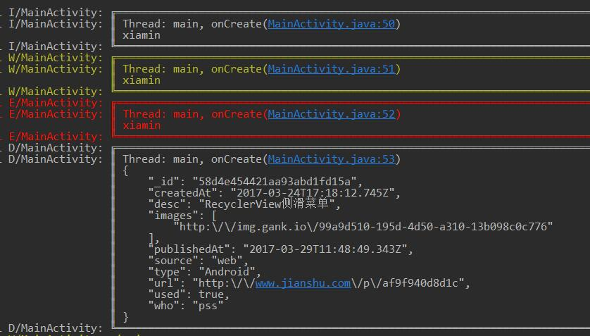
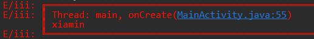
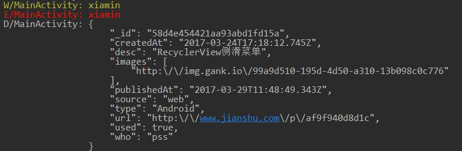

## LogTools
---

这是一个可以控制打印等级的仿Logger效果的打印等级库，后续会加入更多功能，如日志文件保存等。

目前功能有：
- 打印等级控制
- 默认获取当前类名作为默认TAG
- 打印时，打印当前线程及行号等

-------
## import/引入

module's build.gradle (模块的build.gradle)

``` gradle
	dependencies {
	         compile 'com.jerey.logtools:logtools:0.4'
	}
```
----

## Usage/用法

##### 1.直接使用
直接使用，默认有边框，默认所有都打印，默认使用类名为TAG
``` java
  //未做初始化，默认使用
  LogTools.i("xiamin");
  LogTools.w("xiamin");
  LogTools.e("xiamin");
  LogTools.json(text_json);
```



使用自定义TAG

``` java
  LogTools.e("iii","xiamin");
```


##### 2.进行打印等级等配置
设置取消边框，设置打印等级为WARN，那么打印等级低于WARN的都不会被打印 <br>
(打印等级为：Log.VERBOSE < Log.DEBUG < Log.INFO < Log.WARN < Log.ERROR < Log.ASSERT)

``` java
  //更新配置，取消边框，设置打印等级WARN
  new LogTools.Settings()
          .setBorderEnable(false)
          .setLogLevel(Log.WARN);
  LogTools.i("xiamin");
  LogTools.w("xiamin");
  LogTools.e("xiamin");
```
我们可以看到，info等级的log不会被打印




-----------------------

## Why this library ?

To help developer control log easily. We don't want write `private static final String TAG = "xxx"`

-------
##License

```
Copyright 2017 Jerey-Jobs.

Licensed under the Apache License, Version 2.0 (the "License");
you may not use this file except in compliance with the License.
You may obtain a copy of the License at

   http://www.apache.org/licenses/LICENSE-2.0

Unless required by applicable law or agreed to in writing, software
distributed under the License is distributed on an "AS IS" BASIS,
WITHOUT WARRANTIES OR CONDITIONS OF ANY KIND, either express or implied.
See the License for the specific language governing permissions and
limitations under the License.
```
